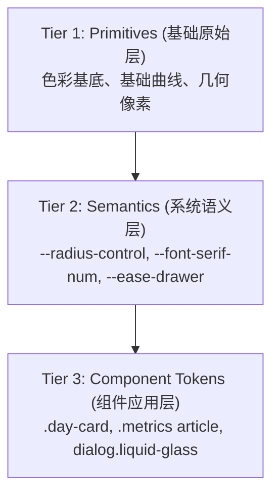

# 霞光预报 Design System 规范手册 (Living Design System)

> **版本**: 1.0.0  
> **更新时间**: 2026-09  
> **真理源 (Single Source of Truth)**: [`css/style.css`](file:///Users/lumiaqian/tools/firecloud/css/style.css)  
> **设计哲学**: 自然气象主义 (Natural Weather Materiality) + 苹果级流体交互 (Apple Fluid Interface)

---

## 1. 核心设计哲学 (Design Philosophy)

《霞光预报》是一个专注于晨昏天光与气象美学的纯静态 PWA。它的核心美学建立在**双层材质体系 (Dual Materiality)** 与 **原生无依赖 (Zero-Dependency)** 之上：

### 1.1 双层材质体系 (Dual Materiality)
页面在纵深上严格解耦为两层，严禁混淆穿透：
1. **气象画卷层 (Atmospheric Canvas, z-index: 0)**:
   - 由动态天光渐变（`var(--sky-top)`, `var(--sky-mid)`, `var(--sky-horizon)`）、云层雾气光斑、粒子物理引擎（雨、雪、雷暴、冰雹、暗星、热浪）构成。
   - 随不同分档（`epic`, `great`, `fair`, `dull`）和当前天气（`clear`, `rain`, `fog` 等）实时流转，负责营造真实而沉浸的情绪氛围。
2. **功能操作层 (Functional Layer & Liquid Glass, z-index: 1~10)**:
   - 包含顶部导航、事件 Tab、数据读数、未来预报卡片与手势抽屉。
   - **严格克制原则**：Liquid Glass（流动毛玻璃）**仅用于功能件与卡片容器**，严禁在全局或深层节点滥用 `backdrop-filter`，确保在移动端高刷新率（ProMotion 120Hz）下的极致流畅。

### 1.2 纯净与现代 Web 原生标准
- **零构建、零外部样式库**：不引入 Tailwind、Bootstrap、Storybook 等重型构建流水线。
- **现代原生 CSS 特性**：全面拥抱 CSS Custom Properties、`color-mix()`、`backdrop-filter`、`scroll-snap`、`text-wrap: balance / pretty`。

---

## 2. Design Tokens 规范体系 (DTCG 3-Tier)

遵循 W3C Design Tokens Community Group (DTCG) 的分层标准，Tokens 采用严格单向向下引用的 3-Tier 结构：



---

### 2.1 圆角阶梯系统 (Radii Scale)

项目中严禁出现任意未定义圆角，所有圆角收敛为 3 层语义 Token 与 1 个特异纯几何圆：

| Token 名称 | 变量值 | 语义角色 | 适用组件与元素 |
| :--- | :--- | :--- | :--- |
| **`--radius-control`** | `12px` | **交互控件与操作行** | 主操作按钮 (`.primary`, `.text-button`)、搜索输入框 (`.search-field`)、当前位置行 (`.location-row`) |
| **`--radius-card`** | `18px` | **容器卡片与数据条** | 一体化气象数据条 (`.metrics`)、7日预报卡片 (`.day-card`)、模态抽屉/弹窗 (`dialog`, `dialog.liquid-glass`)、色调功能卡 (`.liquid-glass.glass-tint`) |
| **`--radius-pill`** | `999px` | **胶囊件与指示器** | 顶部品牌药丸 (`.brand`)、Tab 切换栏 (`.event-tabs`)、手势拖拽把手 (`.drawer-handle`)、卡片顶层光晕条 (`.day-card::before`) |
| *Geometric Circle* | `50%` | **纯几何圆形 (非 Token)** | 加载环 (`.loader`)、品牌中心点 (`.brand-mark`)、圆形关闭/删除按钮 (`.icon-button`, `.delete-favorite`) |

---

### 2.2 字体排印体系 (Typography Hierarchy)

排版是界面古典质感与科学可读性的核心。字体按功能严格分为 4 层栈：

```css
:root {
  /* 标题与品牌古典衬线 */
  --font-serif-title: "Hiragino Mincho ProN", "Songti SC", "STSong", serif;
  /* 气象指数与数据专属衬线（排印必须搭配 tabular-nums，首选 Georgia 保障纯正数字与单位比例） */
  --font-serif-num: "Georgia", "Newsreader", "Playfair Display", "Baskerville", "Iowan Old Style", "Times New Roman", serif;
  /* 序列编号与技术元数据等宽 */
  --font-mono: "SFMono-Regular", Menlo, Monaco, Consolas, monospace;
  /* 全局正文与现代交互界面 */
  --font-sans: -apple-system, BlinkMacSystemFont, "Avenir Next", "PingFang SC", "Hiragino Sans GB", sans-serif;
}
```

#### 排印场景对照规则
1. **`--font-serif-title`**：
   - 适用：大标题 (`.welcome h1`)、品牌标 (`.brand-copy strong`)、晨昏时钟 (`.event-time`)、章节标题 (`.section-head h2`)、分档定性词 (`.band`)、弹窗大标题 (`.dialog-head h2`)。
   - 规则：大标题必须配合 `text-wrap: balance`，消除孤字换行。
2. **`--font-serif-num`**：
   - 适用：霞光总分 (`.score-row strong`)、观测数据读数 (`.metrics strong`)、未来7日单日大分 (`.day-card strong`)。
   - **硬性规则**：必须显式声明 `font-variant-numeric: lining-nums tabular-nums`，确保数字在更新与滚动时横向完全等宽对齐，严禁数字跳动。
3. **`--font-mono`**：
   - 适用：章节序号 (`01 / 02 / 03`)、时间步元数据 (`.data-meta`)、技术说明前缀。
4. **`--font-sans`**：
   - 适用：全局正文、气象建议、说明文本、表单输入、按钮文本。
   - 规则：正文段落必须配合 `text-wrap: pretty`。

---

### 2.3 色彩分档与语义映射 (Mood Tiers & Semantics)

霞光指数分为 4 个标准情绪档位，各档位统领全局的天空底色、粒子光泽与微光反射：

| 档位 Tier | 霞光指数区间 | 语义信号色 (`--signal`) | 天空主情绪与意象 |
| :--- | :--- | :--- | :--- |
| **`epic`** | 80 ~ 99 | `#ffd07c` (金赤) | 深空邃蓝转炽烈燃霞，光晕饱和，粒子辉映 |
| **`great`** | 60 ~ 79 | `#edb56f` (琥珀暖金) | 经典晚霞，暖橙泛金，天光通透 |
| **`fair`** | 40 ~ 59 | `#d9b184` (柔棕米金) | 平和静谧，轻云微染，低饱和度暖调 |
| **`dull`** | 0 ~ 39 | `#aeb8b8` (冷灰霜白) | 铅云密布或水汽灰蒙，沉着冷静 |

---

## 3. 动效与触觉物理学规范 (Motion & Physics)

《霞光预报》的动画交互严格遵循 Apple Human Interface Guidelines 规范，杜绝突兀的无缓动变化。

### 3.1 缓动曲线参数 (Curves & Easings)
```css
:root {
  /* 基础平滑出动 (160ms - 220ms)，用于 hover、微位移、轻量变色 */
  --ease-out: cubic-bezier(0.2, 0.9, 0.2, 1);
  /* 物理弹簧微感 (280ms)，用于局部高光浮动、状态激活 */
  --ease-spring: cubic-bezier(0.34, 1.56, 0.64, 1);
  /* 苹果原生抽屉弹簧曲线 (280ms - 320ms)，用于 Sheet 进场与 Settling */
  --ease-drawer: cubic-bezier(0.32, 0.72, 0, 1);
}
```

### 3.2 触觉微反馈规范 (Tactile Haptics)
所有可点击元素必须遵循以下完整的交互状态链：

```
[Rest 默认态] ──(fine-hover)──> [Hover 浮动态 (仅在有鼠标时)]
      │
      └──────(pointerdown)─────> [Active 按压物理缩放]
```

- **按压微缩放 (Active Scale)**:
  - 按钮与列表行：`:active { transform: scale(0.975 ~ 0.98); }`
  - 卡片：`:active { transform: scale(0.985); }`
  - 药丸切换按钮：`:active { transform: scale(0.97); }`
- **悬停隔离原则 (Hover Pointer Guard)**:
  - **严禁直接裸写 `:hover`**，所有悬停样式必须包裹于：
    ```css
    @media (hover: hover) and (pointer: fine) {
      .my-component:hover { /* 仅限鼠标指针设备触发 */ }
    }
    ```
  - 这彻底根除了 iOS Safari 和 Android Chrome 触摸滑动时产生的粘滞性 hover 视觉假象。

### 3.3 弹窗与手势抽屉规范 (Responsive Modal & Sheet)
[places-dialog](file:///Users/lumiaqian/tools/firecloud/index.html#L137) 严格遵循响应式双模态设计（Desktop Centered Modal vs. Mobile Sheet）：
- **桌面端 (Desktop >680px)**：
  - 呈现为居中浮动磨砂窗 (`dialog.liquid-glass`)，**完全隐藏触摸拖拽把手 (`.drawer-handle { display: none; }`)**。
  - 关闭按钮采用 32px 极简微光圆钮，与标题组纵向绝对居中对齐；入场采用 `dialog-modal-enter` 微缩放平滑缓动。
- **移动端 (Mobile ≤680px)**：
  - 激活原生手势抽屉（Swipe-to-Dismiss Sheet），显式呈现胶囊把手 (`.drawer-handle`)。
  - **拖拽跟随 (Direct Manipulation)**：在 `pointermove` 过程中，抽屉 `transform: translateY(dY)` 实时跟手，阻尼系数在向上越界时自动衰减。
  - **背景透光率随动**：`--backdrop-opacity` 随下拉位移线性衰减（$1.0 \to 0$），手势与视觉完全共振。
  - **阈值裁决**：
    - 超过 $100\text{px}$ 或向下加速度矢量大于 $0.5\text{px/ms}$ $\to$ 执行流畅出场动画并关闭。
    - 未达到阈值 $\to$ 应用 `--ease-drawer` 平滑弹回原位（Settling）。

### 3.4 天体日冕加载器规范 (Celestial Twilight Corona Loader)
告别生硬机械的通用 1px CSS 细圈 Spinner，严格遵循 Emil Kowalski 动效哲学与 Apple 界面物理学构建具有天体美感的霞光透光加载体系：
- **感知性能法则 (Perceived Performance)**：根据 `emil-design-eng` 规范，过慢的转圈会直接放大用户对卡顿的心理感知；外轨日冕彗尾采用 `0.95s` 匀速旋转，赋予界面敏捷、充满活力的实时响应感。
- **100% GPU 合成层加速 (Strict GPU-Only Motion)**：严格禁绝在 `@keyframes` 中直接动画改变 `box-shadow` 或 `filter`（防止浏览器逐帧触发 CPU 重绘与 Layout Thrashing）；全量动效仅作用于 `transform` 与 `opacity`。
- **高保真矢量双天体轨道 (`.loader-rings`)**：采用精细 SVG 矢量绘制，杜绝圆角 Mask 在特定浏览器上的边缘方形伪影（Mask Corner Glitch）：
  - **外轨日冕彗尾 (`.ring-comet`)**：88px 矢量环，采用渐变彗尾与圆润端头（`stroke-linecap: round`），搭配微弱落日光晕（`drop-shadow`）顺时针巡弋。
  - **内轨星盘刻度 (`.ring-orbit`)**：52px 虚线同心圆环，以 3.6s 逆时针匀速旋转，营造天文仪器般的深邃天体韵律。
  - **微型日核与地平线辉光 (`.loader-core` / `.loader-ambient`)**：中心 12px 金色日核与背衬柔和漫射光晕，仅通过 `scale` 和 `opacity` 进行 2~3s 的呼吸起伏。
- **无障碍降级与进场收敛**：面板进场严格遵循“禁止 `scale(0)`”规则，从 `scale(0.96) translateY(4px)` 平滑展开；在 `@media (prefers-reduced-motion: reduce)` 下暂停旋转，日冕彗尾自动合拢为纯净静态光环。

---

## 4. 空间节奏与组件视觉阶梯 (Component Progression)

首页三大核心章节建立了从“信息平铺”到“精密数据条”再到“沉浸大卡”的渐进式空间节奏，彻底杜绝多层卡片堆叠（Card Fatigue）：

```
┌────────────────────────────────────────────────────────┐
│ 01 天空线索 (平铺纯净行, border-bottom, 无多余卡片)     │
└────────────────────────────────────────────────────────┘
                           ▼
┌────────────────────────────────────────────────────────┐
│ 02 观测数据 (--radius-card: 18px 一体化微质感数据刻度带) │
└────────────────────────────────────────────────────────┘
                           ▼
┌────────────────────────────────────────────────────────┐
│ 03 未来 7 日 (--radius-card: 18px 唯一核心通透气象大卡)  │
└────────────────────────────────────────────────────────┘
```

1. **Section 01 (天空线索)**：极简轻盈，采用无圆角单线分隔行，配合轻质大气基线 (`--line: 0.12`)，阅读焦点纯粹停留在定性条件本身。
2. **Section 02 (观测数据 - 精密气象刻度带)**：
   - **全局章节基线统一与纵向呼吸感**：保持与 01、03 一致的 `.section-head` 细腻基线 (`--line-strong: 0.18`)，并通过给仪表带留出 `margin-top: 22px` 的舒展空隙，既保证全页面章节结构的 100% 严整一致，又杜绝了紧贴边框造成的“双横线铁轨”视觉压迫。
   - **数学等分对称与居中校准**：采用 `grid-template-columns: repeat(7, minmax(0, 1fr))` 严谨等分，6 条内嵌发丝分割线在视觉上完全等距对称；单元格内部采用居中校准，标签精准锚定在读数上方，彻底根除因列宽不等导致的虚空与歪斜感。
   - **黑曜石深空透光材质**：`--surface-metrics-bg` 统一采用深海曜石磨砂底色（与 03 保持一致的蓝灰暗色玻璃基底），彻底消除纯白半透明与落日余晖混合产生的“白浊土黄”浑浊斑块。
   - **内嵌发丝微光分割 (告别 Excel 呆板网格)**：移除贯通上下的实线，采用上下各收进 22% 的内嵌渐变发丝线 (`::after` 配合 `linear-gradient` 两端淡出)，呈现瑞士腕表表盘与航空仪表盘般的精致蚀刻刻度。
   - **边角圆弧安全内缩**：首列与尾列分别追加 `padding-left: 18px` 与 `padding-right: 18px`，并约束悬停内径倒角，确保在 18px 圆角边界处绝无文字贴边与高光溢出。
3. **Section 03 (未来预报)**：全页唯一的沉浸式核心大卡，具备自适应昼夜通透微光渐变，顶部附带柔和光晕顶条（`::before`），完全消除传统底边裁剪导致的暗斑阴影（Dark Chin Glitch）以及黑雾遮罩问题。
   - **桌面端 7 列全景并列 (Desktop Panoramic Grid)**：在桌面端 (`@media (min-width: 960px)`) 采用 `grid-template-columns: repeat(7, minmax(0, 1fr))`，7 天卡片一次性完整呈现，彻底杜绝第 6、7 天卡片被侧边硬生生截断（Cut-off Glitch）的不完整体验。
   - **移动与小屏双向渐隐边缘 (Bidirectional Fade Mask)**：在 `<960px` 横向滚动状态下，废弃容易产生脏底色色差的渐变遮罩伪元素，统一采用原生 CSS `mask-image: linear-gradient(...)` 动态感知滚动状态（`is-at-start` / `is-at-end`），呈现平滑通透的边缘淡出。
   - **语义化人性格化倒计时与状态胶囊 (Humanized Countdown Pill)**：倒计时采用微光药丸胶囊（含呼吸高光信号点），规避机械化的 `0小时17分钟`，智能输出 `17分钟`；数据来源配置绿色实时脉冲圆点与状态切换。

---

## 5. 约束与防熵增守则 (Engineering Constraints & Anti-Patterns)

为保持代码库的极高一致性，无论是人类工程师还是 AI 智能体，编写样式与组件时必须严格遵循以下规则：

### ❌ 绝对禁止 (Prohibited Anti-Patterns)
1. **禁止魔法尺寸 (No Magic Numbers)**：严禁在样式中写 `border-radius: 6px / 7px / 14px / 16px / 20px / 24px`，必须引用 `--radius-control`、`--radius-card` 或 `--radius-pill`。
2. **禁止裸写 `:hover`**：严禁在无 `@media (hover: hover) and (pointer: fine)` 保护的情况下编写 `:hover` 规则。
3. **禁止非等宽数值混排**：动态数字必须搭配 `font-variant-numeric: lining-nums tabular-nums`。
4. **禁止全屏或深层堆叠毛玻璃**：毛玻璃（`backdrop-filter`）严禁嵌套在已有毛玻璃的子容器内部，避免移动端 GPU 掉帧。
5. **禁止引入第三方 CSS 框架**：严禁引入 Tailwind、Bootstrap、Sass 等外部依赖，保持纯净原生。

### ✅ 推荐与必须 (Mandatory Rules)
1. **搜索框软键盘保护**：所有搜索类输入框必须标注 `autocomplete="off" autocorrect="off" autocapitalize="off" spellcheck="false"`。
2. **优雅降级 (Graceful Degradation)**：任何使用 `backdrop-filter` 的组件，必须在 `@supports not (backdrop-filter: blur(1px))` 中声明高不透明度实色降级背景。
3. **动态减弱动效**：系统必须响应 `@media (prefers-reduced-motion: reduce)`，禁用粒子和激烈过渡。
4. **验证流程**：任何样式与逻辑修改完成后，必须运行 `npm run verify`，确保代码语法与 28 项全量单元测试 100% 通过。
